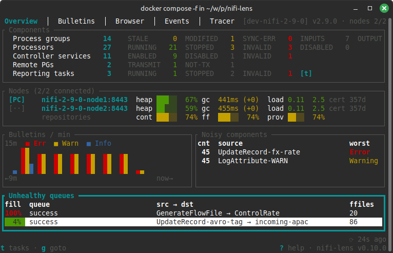
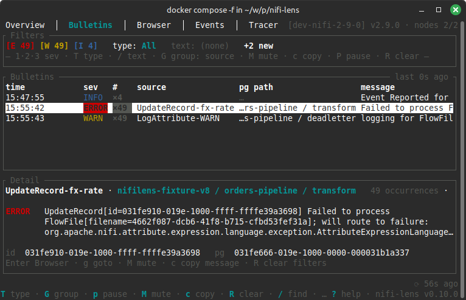
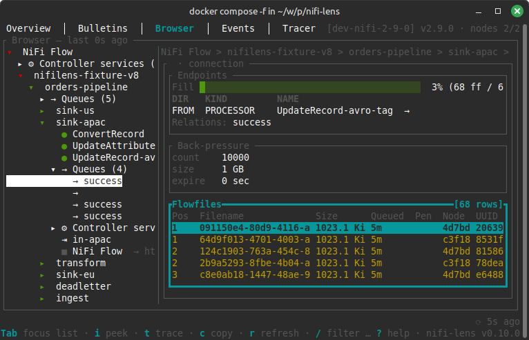
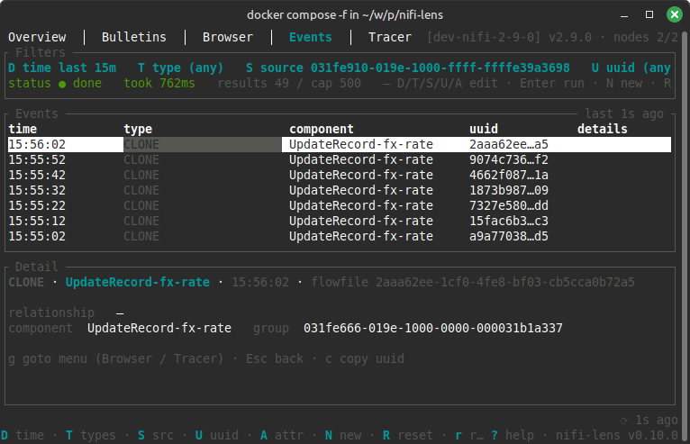
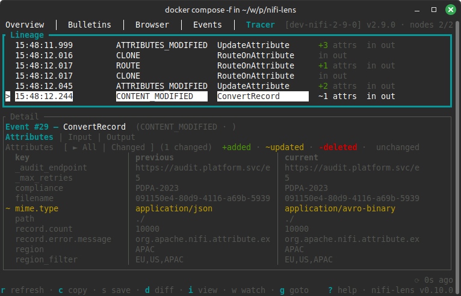
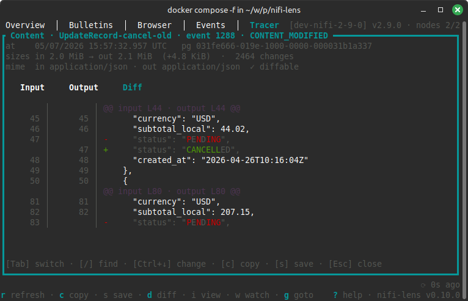

# nifi-lens

> A keyboard-driven TUI lens into Apache NiFi 2.x. Browse flows,
> trace flowfiles, tail bulletins, and debug across clusters and versions.

[](https://github.com/maltesander/nifi-lens/actions/workflows/ci.yml)
[](https://crates.io/crates/nifi-lens)
[](https://docs.rs/nifi-lens)
[](LICENSE)


## Screenshots

**Overview** — Cluster health at a glance: "Is this cluster OK right now?"



**Bulletins** — Live cluster-wide bulletin tail: "What is the cluster complaining about?"



**Browser** — Flow tree with per-node detail: "Where does X live and what is it doing?"



**Events** — Provenance search and detail: "What just happened across the cluster?"



**Tracer** — Flowfile lineage with attribute diff: "Why did this flowfile fail?"



**Tracer** — Content preview (Input / Output tabs): "Why did this flowfile fail?"



## Features

- **Cluster overview** — health dashboard with bulletin-rate sparkline, queue backpressure, per-node heap/GC, and noisiest components.
  - **Per-node cluster membership** — primary / coordinator badges, heartbeat age, and a redesigned per-node detail modal with per-disk repository usage and a node-events timeline.
- **Bulletin tail** — live cluster-wide log with severity filters, source deduplication, per-source mute, and a full-screen detail modal with scroll + substring search.
- **Flow browser** — component tree with per-node detail.
  - **Cross-navigation** — detail rows whose value is a known component render a trailing `→` and jump to it on Enter. Covered surfaces: connection endpoints (FROM/TO), processor / CS property values that are component UUIDs, processor `Connections` section, process-group `Controller services` section. Controller Service and Port Identity panels resolve the parent group UUID to the PG name.
  - **Fuzzy search** across all known components.
- **Provenance events** — filterable cluster-wide event search cross-linked from Bulletins and Browser.
- **Flowfile tracer** — paste a UUID to trace its full lineage with attribute diffs, an inline content preview, and…
- **Content viewer modal** — full-screen content viewer (Input / Output / Diff tabs) that streams large flowfile bodies in 512 KiB chunks up to a configurable ceiling, renders a colored unified diff when both sides share a MIME type, and supports in-body substring search with match highlighting.
- **Multi-cluster** — kubeconfig-style contexts; one binary for every NiFi 2.x version.
- **Read-only** — v0.x never mutates cluster state.

## Install

```bash
cargo install nifi-lens
```

From source:

```bash
git clone https://github.com/maltesander/nifi-lens
cd nifi-lens
cargo install --path .
```

## Quick Start

Create `~/.config/nifilens/config.toml`:

```toml
current_context = "dev"

[[contexts]]
name = "dev"
url = "https://nifi-dev.internal:8443"
version_strategy = "closest"   # strict | closest | latest
insecure_tls = false

[contexts.auth]
type = "password"
username = "admin"
password_env = "NIFILENS_DEV_PASSWORD"
```

The config must be user-only readable — `nifilens` refuses to start
otherwise. Set permissions, export the password, and launch:

```bash
chmod 0600 ~/.config/nifilens/config.toml
export NIFILENS_DEV_PASSWORD=...
nifilens
```

Press `?` inside the tool for a context-aware help modal. A hint line at
the bottom shows relevant keybindings for the current view.

## Core Components

Five top-level tabs, each targeting a specific operational question.

**Overview** — Cluster health at a glance. A Components panel at the top
summarises process groups (count, version-sync drift, port counts),
processors (per-state counts), and controller services (per-state
counts). Below it: a bulletin-rate sparkline, queue backpressure,
repository fill, per-node health strips, and the noisiest components.

- Per-node TLS certificate expiry — visible chip on the Nodes list,
  full chain breakdown in the node detail modal. One handshake per
  node per hour by default (`[polling.cluster] tls_certs`).

**Bulletins** — Live cluster-wide bulletin tail with severity,
component-type, and free-text filters. Deduplication collapses
repeating errors from the same component into a single `×N` row. A
full-screen detail modal shows the full raw message with substring
search.

**Browser** — Two-pane process-group tree with per-node detail.
Controller services and queues appear as first-class tree nodes under
their owning PG, bucketed inside named folders. Input / output ports
have their own detail panes. The controller-service detail pane lists
every component that references it, each jumpable. Properties are
browsable in a dedicated modal. The tree loads lazily the first time
you open the tab — cross-tab `g` / `Shift+F` will only see Browser
components after Browser has been visited at least once per session.

**Events** — Provenance search with a filter bar (time / type / source /
flowfile UUID / attribute). Results are colored by event type and
cross-linked from Bulletins and Browser.

**Tracer** — Paste a flowfile UUID to trace its full lineage. Each event
has a tabbed detail pane (Attributes | Input | Output) with a toggleable
All / Changed attribute diff and an inline 8 KiB content preview. A
full-screen content viewer modal streams larger bodies on demand and
can render a colored unified diff between input and output.

## Keybindings

`?` opens a context-aware help modal. The hint bar at the bottom always
shows what's available on the current view. The tables below are a
reference; you don't need to memorise them.

### Global

| Key                 | Action                                           |
|---------------------|--------------------------------------------------|
| `↑` / `↓`           | Move row selection                               |
| `Tab` / `Shift+Tab` | Switch pane                                      |
| `F1`–`F5`           | Jump directly to a tab                           |
| `Shift+K`           | Switch active cluster context                    |
| `Shift+F`           | Global fuzzy search across all known components  |
| `g`                 | Cross-tab goto menu                              |
| `?`                 | Open context-aware help                          |
| `q` / `Ctrl+C`      | Quit                                             |

### Bulletins

| Key          | Action                                                 |
|--------------|--------------------------------------------------------|
| `1` / `2` / `3` | Toggle ERROR / WARN / INFO severity filter          |
| `Shift+G`    | Cycle group-by mode (source + message / source / off)  |
| `Shift+T`    | Cycle component-type filter                            |
| `Shift+P`    | Pause / resume auto-scroll                             |
| `Shift+M`    | Mute the selected source                               |
| `Shift+R`    | Clear all filters                                      |
| `i`          | Open the bulletin detail modal                         |
| `Enter`      | Jump to source component in Browser                    |
| `c`          | Copy the raw message to clipboard                      |

#### Bulletin detail modal

| Key                        | Action                                      |
|----------------------------|---------------------------------------------|
| `↑↓` / `PgUp` / `PgDn`     | Scroll body                                 |
| `Home` / `End`             | Jump to top / bottom                        |
| `/`                        | Open substring search                       |
| `n` / `N`                  | Next / previous search match                |
| `c`                        | Copy the full message to clipboard          |
| `Enter`                    | Jump to source component in Browser         |
| `Esc`                      | Close the modal                             |

### Browser

| Key          | Action                                                 |
|--------------|--------------------------------------------------------|
| `Enter` / `→` | Expand folder or drill into the selected node         |
| `←`          | Collapse folder or ascend to parent                    |
| `p`          | Open properties (processors and controller services)   |
| `c`          | Copy the selected node's id                            |

### Events

| Key                              | Action                                                  |
|----------------------------------|---------------------------------------------------------|
| `Shift+D` / `T` / `S` / `U` / `A` | Edit filters (time / type / source / UUID / attribute) |
| `Enter` (in filter bar)          | Submit the query                                        |

### Tracer

| Key          | Action                                                 |
|--------------|--------------------------------------------------------|
| `←` / `→`    | Cycle event detail tabs (Attributes / Input / Output)  |
| `d`          | Toggle attribute diff (All / Changed)                  |
| `s`          | Save raw content to a file                             |
| `i`          | Open the full-screen content viewer modal              |
| `c`          | Copy the focused attribute value or selected UUID      |
| `r`          | Refresh the lineage query                              |

#### Content viewer modal

| Key                    | Action                                           |
|------------------------|--------------------------------------------------|
| `Tab` / `Shift+Tab`    | Cycle Input → Output → Diff (skips disabled)     |
| `1` / `2` / `3`        | Jump directly to Input / Output / Diff tab       |
| `↑↓` / `PgUp` / `PgDn` | Scroll body (auto-streams more bytes near tail)  |
| `Home` / `End`         | Jump to top / bottom                             |
| `/`                    | Open substring search                            |
| `n` / `N`              | Next / previous search match                     |
| `Ctrl+↓` / `Ctrl+↑`    | Next / previous change (Diff tab only)           |
| `c`                    | Copy the visible body to clipboard               |
| `s`                    | Save the full raw content to file (uncapped)     |
| `Esc`                  | Close the modal                                  |

#### Tabular content (Parquet & Avro)

Apache Parquet (`PAR1`-magic) and Apache Avro Object Container Files
(`Obj\x01`-magic) are decoded into a schema header followed by
JSON-Lines, one record per line. The same `/` search and Diff tab
work as on text content. Diff between two sides requires the same
format on both sides — Parquet ↔ Avro shows `Mime mismatch`.

**Parquet caveat:** Parquet's metadata footer lives at end-of-file,
so the full file must fit under `[tracer.ceiling] tabular` to decode.
If the fetch hits the ceiling mid-file, the side falls back to a
hex view with a chip explaining the truncation; raise `tabular` or
use `s` to save the partial bytes to disk.

## Configuration

Config file lives at `~/.config/nifilens/config.toml` and is kubeconfig-style:

```toml
current_context = "dev"

# Optional: Bulletins tab ring buffer size. Default 5000; valid range
# 100..=100000. Larger values keep more history at the cost of memory.
[bulletins]
ring_size = 5000

# Optional: Tracer tab options.
[tracer.ceiling]
text    = "4 MiB"     # plain text/hex content per side
tabular = "64 MiB"    # parquet/avro fetched bytes per side
diff    = "16 MiB"    # bytes fed into the unified text diff per side
# Set any value to "0" to disable the ceiling (unbounded).

# Optional: UI rendering options. All fields are optional; the defaults
# below match what the tool uses if you omit the section.
[ui]
# Timestamp display format in Bulletins and Tracer:
#   "short"  — HH:MM:SS for today, "MMM DD HH:MM:SS" for older events
#   "iso"    — 2026-04-12T14:32:18Z (or ...+02:00 with local tz)
#   "human"  — Apr 12 14:32:18
timestamp_format = "short"

# "utc" or "local". "local" uses the host machine's time zone.
timestamp_tz = "utc"

# Optional: per-endpoint poll cadences. See the "Poll intervals" note
# below for the full behavior (adaptive scaling, jitter, subscriber
# gating). Humantime format. Defaults shown.
[polling.cluster]
root_pg_status      = "10s"
controller_services = "10s"
controller_status   = "10s"
system_diagnostics  = "30s"
bulletins           = "5s"
cluster_nodes       = "5s"
connections_by_pg   = "15s"
about               = "5m"
tls_certs           = "1h"
max_interval        = "60s"
jitter_percent      = 20

[[contexts]]
name = "dev"
url = "https://nifi-dev.internal:8443"
version_strategy = "closest"   # strict | closest | latest
insecure_tls = false
# ca_cert_path = "/etc/nifi-lens/certs/dev-ca.crt"   # optional extra CA cert (PEM)
# proxy_url       = "http://proxy.internal:3128"      # all traffic through this proxy
# http_proxy_url  = "http://proxy.internal:3128"      # HTTP traffic only
# https_proxy_url = "http://proxy.internal:3128"      # HTTPS traffic only

[contexts.auth]
type = "password"              # password | token | mtls
username = "admin"
password_env = "NIFILENS_DEV_PASSWORD"

[[contexts]]
name = "prod"
url = "https://nifi-prod.internal:8443"
version_strategy = "strict"

[contexts.auth]
type = "password"
username = "operator"
password_env = "NIFILENS_PROD_PASSWORD"
```

- **Credentials** are configured in the `[contexts.auth]` sub-table. Three
  types are supported:

  | Type | Fields | Notes |
  |------|--------|-------|
  | `password` | `username`, `password_env` or `password` | `password_env` preferred; `password` emits a warning |
  | `token` | `token_env` or `token` | Pre-obtained JWT; `token_env` preferred |
  | `mtls` | `client_identity_path` | PEM containing private key + cert chain |

  Any context can optionally include `proxied_entities_chain = "<user1><user2>"`
  for NiFi proxy deployments.
- **File permissions** must be `0600`; `nifilens` refuses to start if the
  config is world-readable.
- **Poll intervals.** All periodic NiFi fetches are owned by a single
  central `ClusterStore`; there are no per-view pollers. Cadences live
  under `[polling.cluster]` and use humantime values (`"10s"`,
  `"750ms"`). Out-of-band values emit a `tracing::warn!` to the log
  file but are accepted as-is. Each fetch cycle applies a random
  ±`jitter_percent/100` jitter and scales its interval adaptively up to
  `max_interval` when the cluster is slow. Expensive endpoints
  (`root_pg_status`, `controller_services`, `connections_by_pg`) park
  entirely when no view subscribes — i.e. while neither Overview nor
  Browser is the active tab. In-flight polling for Events queries and
  Tracer content stays on its internal cadence.
- **CLI overrides:** `nifilens --context stage`, `nifilens --config ./local.toml`.
- **Version strategy** maps to `nifi-rust-client`'s `VersionResolutionStrategy`.

## Development

See [`AGENTS.md`](AGENTS.md) for architecture, build / test / release
procedures, and contributor conventions.

### Running the integration fixture locally

`nifi-lens` ships with a Docker-based integration fixture that brings up
two NiFi versions simultaneously and pre-seeds them with a realistic flow
— running pipelines, a back-pressured queue, multi-severity bulletins,
nested process groups, and a handful of controller services. Use it to
test `nifi-lens` against live clusters without touching production.

```bash
./integration-tests/run.sh
```

This boots `apache/nifi:2.6.0` (standalone, port 8443) and a 2-node
`apache/nifi:2.9.0` cluster (ports 8444-8445) with ZooKeeper, seeds both
via the `nifilens-fixture-seeder` workspace binary, runs the
`#[ignore]`-gated integration suite, then tears the containers down.

For long-running live testing, skip the test step and leave the fixture
up:

```bash
# First-time only: generate the CA + server certs the containers mount.
./integration-tests/scripts/generate-certs.sh

# --wait blocks until every service's healthcheck goes green; NiFi can
# take several minutes to finish booting on a cold start.
docker compose -f integration-tests/docker-compose.yml up -d --wait

export NIFILENS_IT_PASSWORD=adminpassword123
cargo run -p nifilens-fixture-seeder -- \
    --config integration-tests/nifilens-config.toml \
    --context dev-nifi-2-9-0
cargo run -- --config integration-tests/nifilens-config.toml \
    --context dev-nifi-2-9-0
```

The seeder supports `--skip-if-seeded` for idempotent re-runs during
iteration.

## License

Apache-2.0. See [`LICENSE`](LICENSE).
