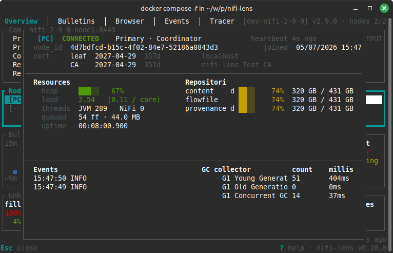
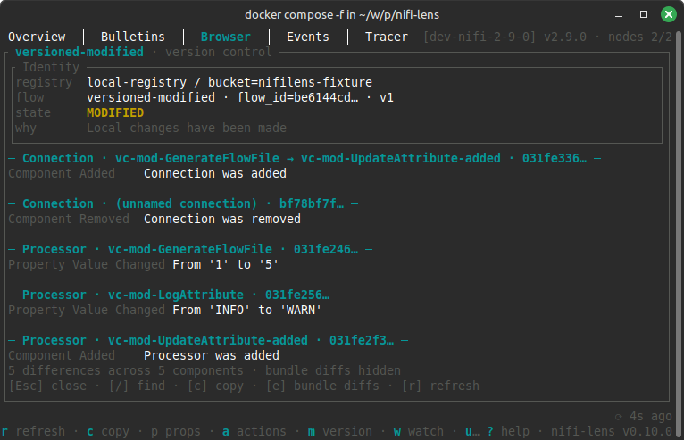
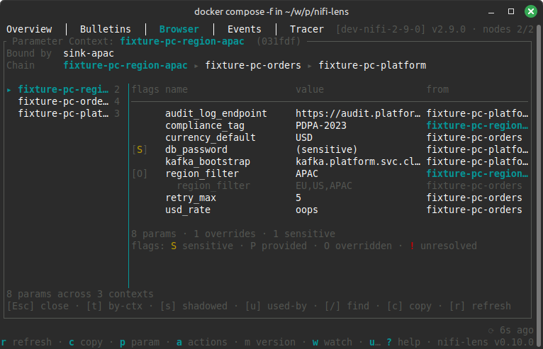

# nifi-lens

> A keyboard-driven TUI lens into Apache NiFi 2.x. Browse flows,
> trace flowfiles, tail bulletins, and debug across clusters and versions.

[](https://github.com/maltesander/nifi-lens/actions/workflows/ci.yml)
[](https://crates.io/crates/nifi-lens)
[](https://docs.rs/nifi-lens)
[](LICENSE)


## Contents

- [Screenshots](#screenshots)
- [Features](#features)
- [Install](#install)
- [Quick Start](#quick-start)
- [Flags](#flags)
- [Required NiFi permissions](#required-nifi-permissions)
- [Core Components](#core-components)
- [Keybindings](#keybindings)
- [Configuration](#configuration)
- [Logs](#logs)
- [Development](#development)

## Screenshots

**Overview** — Cluster health at a glance: "Is this cluster OK right now?"


**Node details** — Detailed per node information: "What is this node doing?"



**Bulletins** — Live cluster-wide bulletin tail: "What is the cluster complaining about?"


**Browser** — Flow tree with per-node detail: "Where does X live and what is it doing?"


**Browser** — Versioned process-groups: "What changed in this process group?"



**Browser** — Parameter-contexts: "Where does this parameter come from?"



**Events** — Provenance search and detail: "What just happened across the cluster?"


**Tracer** — Flowfile lineage with attribute diff: "Why did this flowfile fail?"


**Tracer** — Content preview and diff for CSV, JSON, AVRO and PARQUET: "What changed in the flowfile content?"


## Features

- **Cluster overview** — health dashboard with bulletin sparkline, queue backpressure, per-node heap/GC, role/status badges, and a four-quadrant node detail modal.
- **Bulletin tail** — live cluster-wide log with severity filters, source dedup, per-source mute, and a full-screen detail modal with substring search.
- **Flow browser** — component tree with per-node detail, cross-navigation (`→` jumps between related components), and fuzzy search (`:proc`, `:pg`, `:cs`, `:drift`, …).
- **Version control drift** — `[STALE]` / `[MODIFIED]` / `[SYNC-ERR]` chips on versioned PGs and a full-screen modal with per-component diff against the registry.
- **Parameter contexts** — `p` on any PG opens a full-screen modal showing the inheritance chain, resolved-flat parameters table, and reverse-lookup; `#{name}` references in property values cross-link straight to the parameter.
- **Action history** — `a` on any UUID-bearing Browser row (processor, PG, connection, controller service, port) opens a full-screen audit log of NiFi flow-configuration changes for that component. Paginated with auto-load on scroll, substring search (`/`), and copy-as-TSV (`c`).
- **Provenance events** — filterable cluster-wide event search cross-linked from Bulletins and Browser.
- **Flowfile tracer** — paste a UUID for full lineage with attribute diffs and a full-screen content viewer that streams large bodies in 512 KiB chunks and renders colored unified diffs (JSON / CSV / Parquet / Avro).
- **Multi-cluster** — kubeconfig-style contexts; one binary for every NiFi 2.x version.
- **Read-only** — v0.x never mutates cluster state.

## Install

Prebuilt binaries and installers for Linux (x86_64 / aarch64, gnu + musl),
macOS (x86_64 / aarch64), and Windows (x86_64) are attached to each
[GitHub Release](https://github.com/maltesander/nifi-lens/releases/latest).

One-line installers:

```bash
# Linux / macOS
curl --proto '=https' --tlsv1.2 -LsSf \
  https://github.com/maltesander/nifi-lens/releases/latest/download/nifi-lens-installer.sh | sh
```

```powershell
# Windows
powershell -c "irm https://github.com/maltesander/nifi-lens/releases/latest/download/nifi-lens-installer.ps1 | iex"
```

From crates.io (requires a Rust toolchain):

```bash
cargo install nifi-lens
```

From source:

```bash
git clone https://github.com/maltesander/nifi-lens
cd nifi-lens
cargo install --path .
```

## Quick Start

Create the config file (paths below are Linux; see
[Configuration](#configuration) for macOS and Windows, or run
`nifilens config init` to write a template to the right place):

```toml
current_context = "dev"

[[contexts]]
name = "dev"
url = "https://nifi-dev.internal:8443"
version_strategy = "closest"   # strict | closest | latest
insecure_tls = false

[contexts.auth]
type = "password"
username = "admin"
password_env = "NIFILENS_DEV_PASSWORD"
```

The config must be user-only readable — `nifilens` refuses to start
otherwise. Set permissions, export the password, and launch:

```bash
chmod 0600 ~/.config/nifilens/config.toml
export NIFILENS_DEV_PASSWORD=...
nifilens
```

Press `?` inside the tool for a context-aware help modal. A hint line at
the bottom shows relevant keybindings for the current view.

While cluster fetchers are still booting, the status bar shows an
`init: X/11 endpoints ready` chip. The chip disappears once every
endpoint has produced its first snapshot (success or graceful
failure both count). On a slow cluster it may take 10–20 seconds.

## Flags

| Flag | Description |
|------|-------------|
| `--config <PATH>` | Override the config-file path (defaults to the platform config dir — see [Configuration](#configuration)). |
| `--context <NAME>` | Override `current_context` from the config. |
| `--debug` | Equivalent to `--log-level debug`. |
| `--log-level <LEVEL>` | One of `off` / `error` / `warn` / `info` / `debug` / `trace`. Default `info`. Mutually exclusive with `--debug`. |
| `--no-color` | Disable ANSI colors in the TUI and stderr layer. |

The `NO_COLOR` env var (per [no-color.org](https://no-color.org/))
is honored alongside `--no-color`: any non-empty value disables
colors. Useful for CI logs and screen readers.

The `NIFILENS_LOG` and `RUST_LOG` env vars set the log filter when
no `--log-level` / `--debug` flag is given. Same syntax as the
`tracing` filter directive (e.g. `info,nifi_lens=debug`).

## Required NiFi permissions

`nifi-lens` is read-only. It issues only `GET`, idempotent `POST` for
provenance searches, and `DELETE` for cleaning up its own provenance
and lineage queries. The user it authenticates as needs the following
NiFi 2.x policies — nothing more:

**Global policies:**

| Policy | Why |
|---|---|
| `view the UI` | Baseline for any API access. |
| `access the controller` | `/flow/status` (version-sync + component counts) and `/controller/cluster` (cluster membership + heartbeats). |
| `view system diagnostics` | `/system-diagnostics` (heap, GC, repository fill, per-node metrics). |
| `query provenance` | All Events and Tracer operations — provenance search, lineage, event detail. |

**Component-level policies** — grant these on the **root Process Group**;
they cascade to every descendant:

| Policy | Why |
|---|---|
| `view the component` | Flow browser, status polling, bulletins, processor / controller-service / connection / port detail. |
| `view the data` | *Optional.* Only needed when the Tracer content viewer modal is used (`/provenance-events/{id}/content/{input\|output}`). Strict monitoring-only users can omit this — the modal renders a `403` banner instead of the body. |

**Not required:**

- Any `modify …` policies — `nifi-lens` never writes.
- `access restricted components` — no restricted components are executed.
- `access users / user groups / policies / counters`.
- `retrieve site-to-site details`.

## Core Components

Five top-level tabs, each targeting a specific operational question.

**Overview** — Cluster health at a glance. A Components panel at the top
summarises process groups (count, version-sync drift, port counts),
processors (per-state counts), and controller services (per-state
counts). Below it: a bulletin-rate sparkline, queue backpressure,
repository fill, per-node health strips, and the noisiest components.

- Per-node TLS certificate expiry — each Nodes list row carries a
  trailing chip showing the earliest `not_after` in the chain
  (`Nd` under a year, `Ny Mmo` beyond). Severity thresholds:
  expired or `<7d` renders red/bold, `7–30d` yellow, `≥30d` muted
  grey. The chip only goes quiet when there is no data (not-yet-
  probed or probe failed). Opening a node expands to the full chain
  breakdown in the detail modal. Standalone NiFi servers (no
  `/controller/cluster` endpoint) fall back to probing the context
  URL's host+port; HTTP-only contexts skip probing with a one-time
  info log. Cadence is one handshake per node per hour by default
  (`[polling.cluster] tls_certs`).

**Bulletins** — Live cluster-wide bulletin tail with severity,
component-type, and free-text filters. Deduplication collapses
repeating errors from the same component into a single `×N` row. A
full-screen detail modal shows the full raw message with substring
search.

**Browser** — Two-pane process-group tree with per-node detail.
Controller services and queues appear as first-class tree nodes under
their owning PG, bucketed inside named folders. Input / output ports
have their own detail panes. The controller-service detail pane lists
every component that references it, each jumpable. Properties are
browsable in a dedicated modal. The tree loads lazily the first time
you open the tab — cross-tab `g` / `Shift+F` will only see Browser
components after Browser has been visited at least once per session.

### Version control drift

Versioned process groups whose flow has drifted from the registry
render a trailing chip on their Browser tree row: `[STALE]`,
`[MODIFIED]`, `[STALE+MOD]`, or `[SYNC-ERR]`. Press `m` on any such PG
to open the version-control modal — registry / bucket / branch / flow /
version identity at the top, then a per-component, per-property diff
sourced from NiFi's `local-modifications` endpoint. Press `e` to
include or exclude environmental differences (NAR-bundle bumps after a
NiFi upgrade, hidden by default).

For a cluster-wide audit, open Fuzzy Find (`Shift+F`) and type `:drift`
to filter the corpus to all non-clean versioned PGs.

### Parameter contexts

Press `p` on any process group (including root) to open the
parameter-context modal. The modal shows the context's Identity header,
an inheritance chain sidebar (use `←`/`→` to step through ancestors),
and a resolved-flat parameters table listing each parameter's name,
value, originating context, and flag chips: `[O]` override, `[S]`
sensitive, `[P]` provided, `[!]` unresolved. Toggle the by-context view
with `t`, show shadowed entries with `s`, and open the reverse-lookup
("Used by N PGs") panel with `u`.

Processor and controller-service property values that contain `#{name}`
parameter references gain a trailing `→` when the owning PG has a bound
context — pressing Enter jumps directly into the modal pre-selected to
that parameter. `##{...}` escapes are recognized and not annotated.

The PG detail pane also shows a `Parameter context: <name> →` identity
row; pressing Enter there opens the same modal.

**Events** — Provenance search with a filter bar (time / type / source /
flowfile UUID / attribute). Results are colored by event type and
cross-linked from Bulletins and Browser.

**Tracer** — Paste a flowfile UUID to trace its full lineage. Each event
has a tabbed detail pane (Attributes | Input | Output) with a toggleable
All / Changed attribute diff and an inline 8 KiB content preview
(hardcoded — for larger payloads, press `i` to open the full-screen
modal). The modal streams content on demand bounded by
`[tracer.ceiling]` and can render a colored unified diff between
input and output.

## Keybindings

`?` opens a context-aware help modal. The hint bar at the bottom always
shows what's available on the current view. The tables below are a
reference; you don't need to memorise them.

### Global

| Key                 | Action                                           |
|---------------------|--------------------------------------------------|
| `↑` / `↓`           | Move row selection                               |
| `Tab` / `Shift+Tab` | Switch pane                                      |
| `F1`–`F5`           | Jump directly to a tab                           |
| `Shift+K`           | Switch active cluster context                    |
| `Shift+F`           | Global fuzzy search across all known components  |
| `g`                 | Cross-tab goto menu                              |
| `?`                 | Open context-aware help                          |
| `q` / `Ctrl+C`      | Quit                                             |

Inside the Fuzzy Find modal, a leading token narrows the corpus
before fuzzy scoring. Clear the filter by backspacing through the
prefix; the chip row above the query line reflects the active filter.

Kind filters:

| Token   | Narrows to                              |
|---------|-----------------------------------------|
| `:proc` | Processors                              |
| `:pg`   | Process groups                          |
| `:cs`   | Controller services                     |
| `:conn` | Connections                             |
| `:in`   | Input ports                             |
| `:out`  | Output ports                            |

Drift filters (PG-only):

| Token       | Narrows to                                            |
|-------------|-------------------------------------------------------|
| `:drift`    | Any PG whose registry state ≠ `UP_TO_DATE`            |
| `:stale`    | PGs with `STALE` or `STALE+MOD`                       |
| `:modified` | PGs with `MODIFIED` or `STALE+MOD`                    |
| `:syncerr`  | PGs with `SYNC_FAILURE`                               |

### Bulletins

| Key          | Action                                                 |
|--------------|--------------------------------------------------------|
| `1` / `2` / `3` | Toggle ERROR / WARN / INFO severity filter          |
| `Shift+G`    | Cycle group-by mode (source + message / source / off)  |
| `Shift+T`    | Cycle component-type filter                            |
| `Shift+P`    | Pause / resume auto-scroll                             |
| `Shift+M`    | Mute the selected source                               |
| `Shift+R`    | Clear all filters                                      |
| `i`          | Open the bulletin detail modal                         |
| `Enter`      | Jump to source component in Browser                    |
| `c`          | Copy the raw message to clipboard                      |

#### Bulletin detail modal

| Key                        | Action                                      |
|----------------------------|---------------------------------------------|
| `↑↓` / `PgUp` / `PgDn`     | Scroll body                                 |
| `Home` / `End`             | Jump to top / bottom                        |
| `/`                        | Open substring search                       |
| `n` / `N`                  | Next / previous search match                |
| `c`                        | Copy the full message to clipboard          |
| `Enter`                    | Jump to source component in Browser         |
| `Esc`                      | Close the modal                             |

### Browser

| Key          | Action                                                 |
|--------------|--------------------------------------------------------|
| `Enter` / `→` | Expand folder or drill into the selected node         |
| `←`          | Collapse folder or ascend to parent                    |
| `p`          | Open Parameter Context modal (PG selected) / Properties modal (processor or CS selected) |
| `m`          | Show version control (versioned PG only)               |
| `c`          | Copy the selected node's id                            |

### Events

| Key                              | Action                                                  |
|----------------------------------|---------------------------------------------------------|
| `Shift+D` / `T` / `S` / `U` / `A` | Edit filters (time / type / source / UUID / attribute) |
| `Enter` (in filter bar)          | Submit the query                                        |

### Tracer

| Key          | Action                                                 |
|--------------|--------------------------------------------------------|
| `←` / `→`    | Cycle event detail tabs (Attributes / Input / Output)  |
| `d`          | Toggle attribute diff (All / Changed)                  |
| `s`          | Save raw content to a file                             |
| `i`          | Open the full-screen content viewer modal              |
| `c`          | Copy the focused attribute value or selected UUID      |
| `r`          | Refresh the lineage query                              |

#### Content viewer modal

| Key                    | Action                                           |
|------------------------|--------------------------------------------------|
| `Tab` / `Shift+Tab`    | Cycle Input → Output → Diff (skips disabled)     |
| `1` / `2` / `3`        | Jump directly to Input / Output / Diff tab       |
| `↑↓` / `PgUp` / `PgDn` | Scroll body (auto-streams more bytes near tail)  |
| `Home` / `End`         | Jump to top / bottom                             |
| `/`                    | Open substring search                            |
| `n` / `N`              | Next / previous search match                     |
| `Ctrl+↓` / `Ctrl+↑`    | Next / previous change (Diff tab only)           |
| `c`                    | Copy the visible body to clipboard               |
| `s`                    | Save the full raw content to file (uncapped)     |
| `Esc`                  | Close the modal                                  |

#### Structured content (JSON, CSV, Parquet, Avro)

The Diff tab renders a colored unified diff between Input and Output
whenever both sides share a compatible format. Use `Ctrl+↓` /
`Ctrl+↑` to jump between changes.

- **Text formats** (JSON, CSV, plain text) diff directly against
  the raw bytes.
- **Binary formats** — Apache Parquet (`PAR1`-magic) and Apache Avro
  Object Container Files (`Obj\x01`-magic) — are decoded into a
  schema header followed by JSON-Lines (one record per line) before
  rendering or diffing.

Same-format diff only. JSON ↔ CSV or Parquet ↔ Avro renders
`Mime mismatch` and greys out the Diff tab.

**Parquet caveat:** Parquet's metadata footer lives at end-of-file,
so the full file must fit under `[tracer.ceiling] tabular` to decode.
If the fetch hits the ceiling mid-file, the side falls back to a
hex view with a chip explaining the truncation; raise `tabular` or
use `s` to save the partial bytes to disk.

## Configuration

The config file lives in the platform config directory:

- Linux: `~/.config/nifilens/config.toml` (honors `$XDG_CONFIG_HOME`)
- macOS: `~/Library/Application Support/nifilens/config.toml`
- Windows: `%APPDATA%\nifilens\config\config.toml`

Override with `--config <PATH>`. The file is kubeconfig-style:

```toml
current_context = "dev"

# Optional: Bulletins tab ring buffer size. Default 5000; valid range
# 100..=100000. Larger values keep more history at the cost of memory.
[bulletins]
ring_size = 5000

# Optional: Tracer tab options.
[tracer.ceiling]
text    = "4 MiB"     # plain text/hex content per side
tabular = "64 MiB"    # parquet/avro fetched bytes per side
diff    = "16 MiB"    # bytes fed into the unified text diff per side
# Set any value to "0" to disable the ceiling (unbounded).

# Optional: UI rendering options. All fields are optional; the defaults
# below match what the tool uses if you omit the section.
[ui]
# Timestamp display format in Bulletins and Tracer:
#   "short"  — HH:MM:SS for today, "MMM DD HH:MM:SS" for older events
#   "iso"    — 2026-04-12T14:32:18Z (or ...+02:00 with local tz)
#   "human"  — Apr 12 14:32:18
timestamp_format = "short"

# "utc" or "local". "local" uses the host machine's time zone.
timestamp_tz = "utc"

# Optional: per-endpoint poll cadences. See the "Poll intervals" note
# below for the full behavior (adaptive scaling, jitter, subscriber
# gating). Humantime format. Defaults shown.
[polling.cluster]
root_pg_status              = "10s"
controller_services         = "10s"
controller_status           = "10s"
system_diagnostics          = "30s"
bulletins                   = "5s"
cluster_nodes               = "5s"
connections_by_pg           = "15s"
version_control             = "30s"
parameter_context_bindings  = "30s"
about                       = "5m"
tls_certs                   = "1h"
max_interval                = "60s"
jitter_percent              = 20

# Max concurrent in-flight HTTP requests for per-PG fan-out fetchers
# (version_control, parameter_context_bindings, connections_by_pg).
# Default 16. Raise on fast clusters with many PGs; lower if NiFi's
# HTTP thread pool struggles.
batch_concurrency           = 16

[[contexts]]
name = "dev"
url = "https://nifi-dev.internal:8443"
version_strategy = "closest"   # strict | closest | latest
insecure_tls = false
# ca_cert_path = "/etc/nifi-lens/certs/dev-ca.crt"   # optional extra CA cert (PEM)
# proxy_url       = "http://proxy.internal:3128"      # all traffic through this proxy
# http_proxy_url  = "http://proxy.internal:3128"      # HTTP traffic only
# https_proxy_url = "http://proxy.internal:3128"      # HTTPS traffic only

[contexts.auth]
type = "password"              # password | token | mtls
username = "admin"
password_env = "NIFILENS_DEV_PASSWORD"

[[contexts]]
name = "prod"
url = "https://nifi-prod.internal:8443"
version_strategy = "strict"

[contexts.auth]
type = "password"
username = "operator"
password_env = "NIFILENS_PROD_PASSWORD"
```

- **Credentials** are configured in the `[contexts.auth]` sub-table. Three
  types are supported:

  | Type | Fields | Notes |
  |------|--------|-------|
  | `password` | `username`, `password_env` or `password` | `password_env` preferred; `password` emits a warning |
  | `token` | `token_env` or `token` | Pre-obtained JWT; `token_env` preferred |
  | `mtls` | `client_identity_path` | PEM containing private key + cert chain |

  Any context can optionally include `proxied_entities_chain = "<user1><user2>"`
  for NiFi proxy deployments.
- **File permissions** must be `0600`; `nifilens` refuses to start if the
  config is world-readable.
- **Poll intervals.** All periodic NiFi fetches are owned by a single
  central `ClusterStore`; there are no per-view pollers. Cadences live
  under `[polling.cluster]` and use humantime values (`"10s"`,
  `"750ms"`). Out-of-band values emit a `tracing::warn!` to the log
  file but are accepted as-is. Each fetch cycle applies a random
  ±`jitter_percent/100` jitter and scales its interval adaptively up to
  `max_interval` when the cluster is slow. Expensive endpoints
  (`root_pg_status`, `controller_services`, `connections_by_pg`) park
  entirely when no view subscribes — i.e. while neither Overview nor
  Browser is the active tab. In-flight polling for Events queries and
  Tracer content stays on its internal cadence. Browser-only endpoints
  (`version_control`) likewise park while Browser is not the active
  tab.
- **CLI overrides:** `nifilens --context stage`, `nifilens --config ./local.toml`.
  See [Flags](#flags) for the full list.
- **Version strategy** maps to `nifi-rust-client`'s `VersionResolutionStrategy`.

## Logs

`nifi-lens` writes a daily-rotated log to the platform state directory
(never to stdout/stderr while the TUI is running):

- Linux: `~/.local/state/nifilens/` (or `$XDG_STATE_HOME/nifilens/`)
- macOS: `~/Library/Caches/nifilens/`
- Windows: `%LOCALAPPDATA%\nifilens\cache\`

Filenames include a date suffix — `nifilens.log.YYYY-MM-DD` — so the
file you want is the most recent one. To follow the current day's log:

```bash
# Linux / macOS — picks today's file even across midnight rollovers.
tail -f "$(ls -t ~/.local/state/nifilens/nifilens.log.* | head -1)"
```

Old day files accumulate; rotation is purely date-based. Prune
manually if needed.

`F12` inside the TUI dumps the keymap reverse table and per-endpoint
subscriber state to the log file (no visible UI change). Use it when
debugging "why doesn't key X do anything" or "is fetcher Y actually
polling".

## Development

See [`AGENTS.md`](AGENTS.md) for architecture, build / test / release
procedures, and contributor conventions.

### Running the integration fixture locally

`nifi-lens` ships with a Docker-based integration fixture that brings up
two NiFi versions simultaneously and pre-seeds them with a realistic flow
— running pipelines, a back-pressured queue, multi-severity bulletins,
nested process groups, and a handful of controller services. Use it to
test `nifi-lens` against live clusters without touching production.

```bash
./integration-tests/run.sh
```

This boots `apache/nifi:2.6.0` (standalone, port 8443), a 2-node
`apache/nifi:2.9.0` cluster (ports 8444-8445) with ZooKeeper, and an
`apache/nifi-registry:2.6.0` instance (port 18080) that the
`versioned-clean` / `versioned-modified` fixture PGs are committed to
(so the version-control drift modal has real registry data to diff
against). The seeder runs against both NiFi instances via the
`nifilens-fixture-seeder` workspace binary, the `#[ignore]`-gated
integration suite runs, and the containers tear down.

For long-running live testing, skip the test step and leave the fixture
up:

```bash
# First-time only: generate the CA + server certs the containers mount.
./integration-tests/scripts/generate-certs.sh

# First-time only: fetch the Parquet/Hadoop NARs from Maven Central into
# a gitignored cache. The base apache/nifi images don't bundle the
# standalone Parquet writer, so this mount is required for the
# diff-pipeline fixture to enable. `run.sh` invokes this automatically;
# the live-dev workflow needs it run once up front.
./integration-tests/scripts/download-nars.sh

# --wait blocks until every service's healthcheck goes green; NiFi can
# take several minutes to finish booting on a cold start.
docker compose -f integration-tests/docker-compose.yml up -d --wait

export NIFILENS_IT_PASSWORD=adminpassword123
cargo run -p nifilens-fixture-seeder -- \
    --config integration-tests/nifilens-config.toml \
    --context dev-nifi-2-9-0
cargo run -- --config integration-tests/nifilens-config.toml \
    --context dev-nifi-2-9-0
```

The seeder supports `--skip-if-seeded` for idempotent re-runs during
iteration.

## License

Apache-2.0. See [`LICENSE`](LICENSE).
